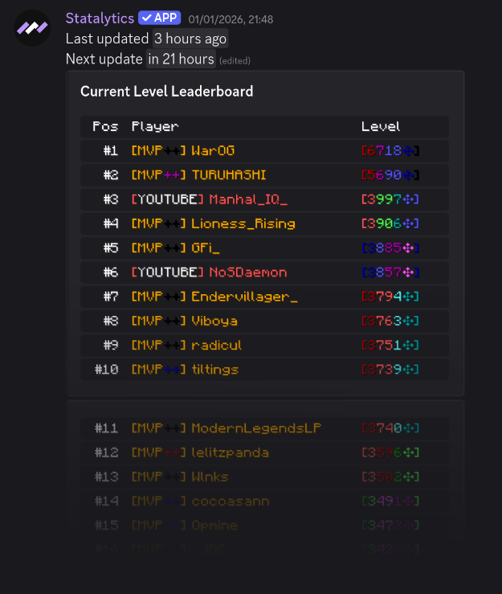

## Description

Statalytics offers both leaderboard commands as well as live leaderboards.

## Leaderboard Commands

import CommandInfo from '../../../components/CommandInfo.jsx';

<CommandInfo
    commandSyntax="/leaderboard level"
    commandDescription="View the Bedwars level leaderboard."
/>

 

 

<CommandInfo
    commandSyntax="/leaderboard wins"
    commandDescription="View the Bedwars wins leaderboard."
/>

 

 

<CommandInfo
    commandSyntax="/leaderboard finals"
    commandDescription="View the Bedwars final kills leaderboard."
/>

## Live Leaderboards

Live leaderboards consist of a message in a certain channel that automatically updates periodically to display the top 100 players in level, wins, or final kills.

> Server admins are able to configure live leaderboards.

 

 

<CommandInfo
    commandSyntax="/liveleaderboard set <channel> <leaderboard>"
    commandDescription="Set live leaderboard channels."
    note="By default, this command is restricted to the 'Manage Server' permission."
    args={[
        {
            "name": "channel",
            "description": "The channel that the live leaderboard will exist in."
        },
        {
            "name": "leaderboard",
            "description": "The live leaderboard type, either level, wins, or final kills."
        }
    ]}
/>

 

 

<CommandInfo
    commandSyntax="/liveleaderboard unset <leaderboard>"
    commandDescription="Unset live leaderboard channels."
    note="By default, this command is restricted to the 'Manage Server' permission."
    args={[
        {
            "name": "leaderboard",
            "description": "The live leaderboard type, either level, wins, or final kills."
        }
    ]}
/>

 

 

<CommandInfo
    commandSyntax="/liveleaderboard list"
    commandDescription="List the live leaderboard channels."
    note="By default, this command is restricted to the 'Manage Server' permission."
/>

